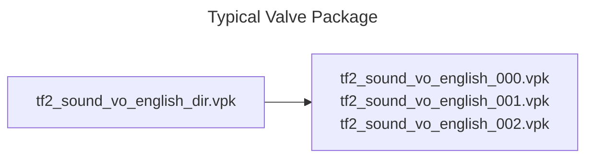

# General Information

In order to convert something, you first have to understand it. The Source Engine has its own file formats and structure.

::: info
The [Valve Developer Community Wiki](https://developer.valvesoftware.com/wiki/) has more in-depth explanations of each topic. Take a look at their website if you're interested.
:::

## Valve Pack

Valve PacK, also known as VPK, is a format used by most modern Source Engine games. It simply stores content.

Keep in mind that the format stores content across multiple files. The directory is stored in a specific file named ``[name]-dir.vpk`` and the actual content is stored in other files named ``[name]-[index].vpk``.

::: info
The index starts from 0 (like most programming languages).
:::

## MoDeL

MDL is Source's model format.

Additional data can be stored in ``PHY``, ``ANI``, ``VTX`` and ``VVD`` files.

## VTF and VMT

The Source Engine defines **M**aterials in VMT files, and those materials reference **T**extures that are stored in the VTF format.

## BSP and VMF

The Hammer Editor stores map projects as VMF files (like a PSD) and the exported map has the BSP extension.
